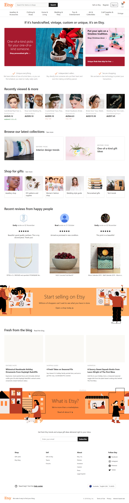
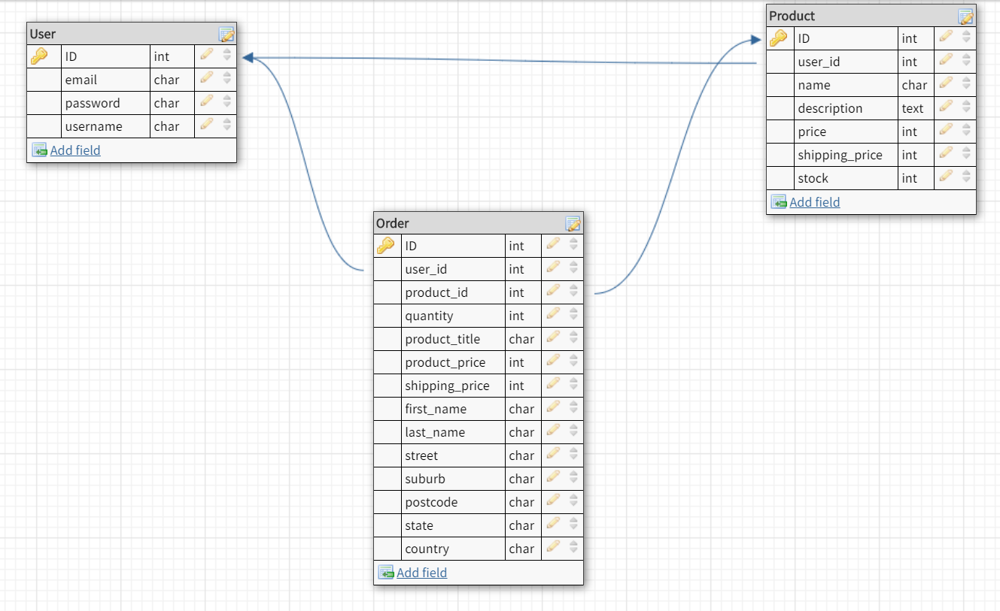
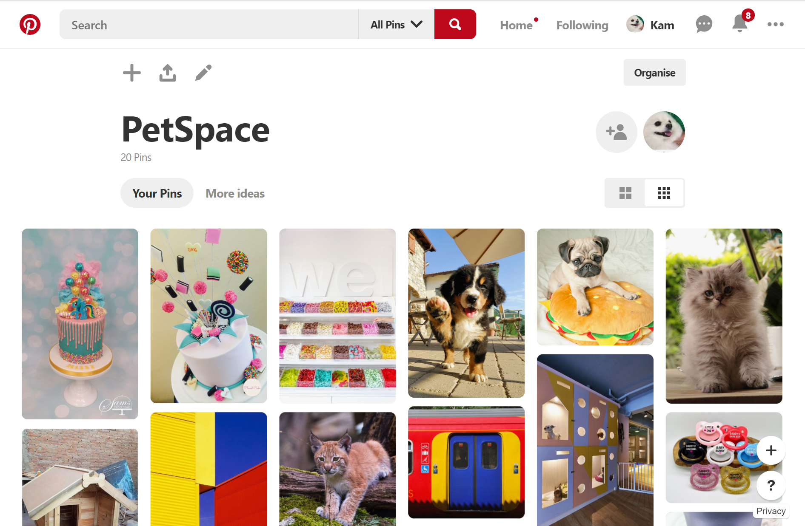
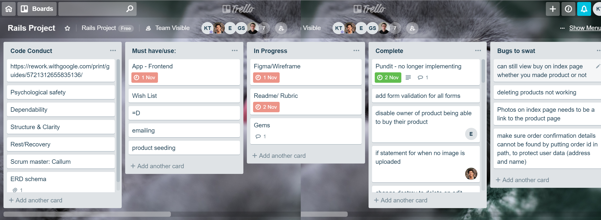
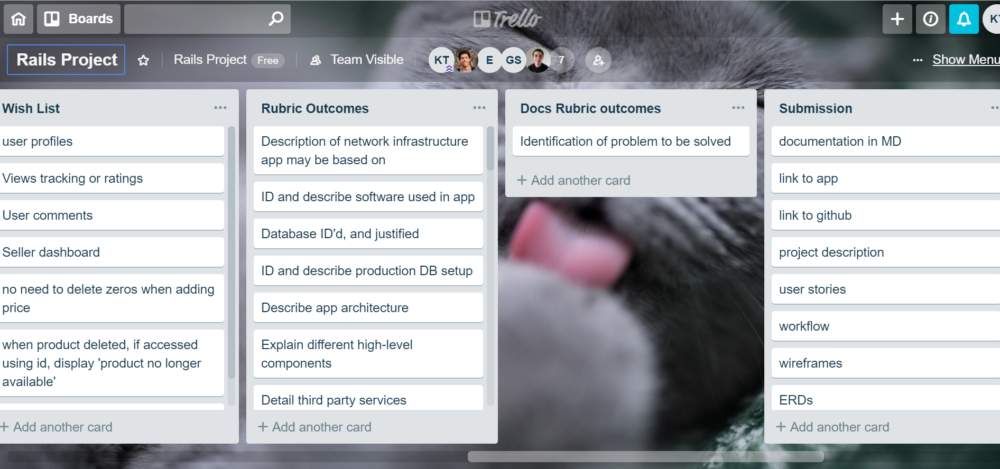

# README

## Inspration

We want to build an e-commerce website focused on handmade pet accessories, as well as unique factory-manufactured items, which is similar to the idea of Etsy. 

## Database Schema

## Database relations
The app is built on a robust database for storing user, product and transaction records.

There are three models in the database:

User table: This table stores information about individual users. 
- Primary Key: email, password & username
  

Product table: These tables store product information. Products are never deleted in the database. 
- Primary Key: name, description, price, shipping price & stock
- Foreign Key: User id 

Order table: These tables store information about order information.
- Primary Key: quantity, product title, product price, shipping price, first name, last name, street, suburb, postcode, state, country
- Foreign Key: user id, product id 

## Active Record Associations
In Rails, an association is a connection between two Active Record models. 

class Order < ApplicationRecord
  belongs_to :user
  belongs_to :product
end

class Product < ApplicationRecord
  belongs_to :user
  has_many :orders
  has_one_attached :image
end

class User < ApplicationRecord
  has_many :products
end

# PetGuest Methodology
## User Stories
### Buyer
- As a user I want to be able to pay online so that I can gain more credit card points and can make a payment anytime
- As a user I want to have my item delivered so that I do not have to drive somewhere to get it
- As a user I want to purchase unique product for my pets
- As a user I want to have items delivered for a low cost so that I can save money
- As a user I want to be able to view the item.

### Seller
- As a seller I am looking for a platform that is easy to use
- As a seller I would like to post my product image on the website
- As a seller I would like to set up an online payment system for my user.

## Wireframes
### Pinterest

## Trello
https://trello.com/b/yvCD3Gal/rails-project

We have equally distributed the work and followed our code conduct.

