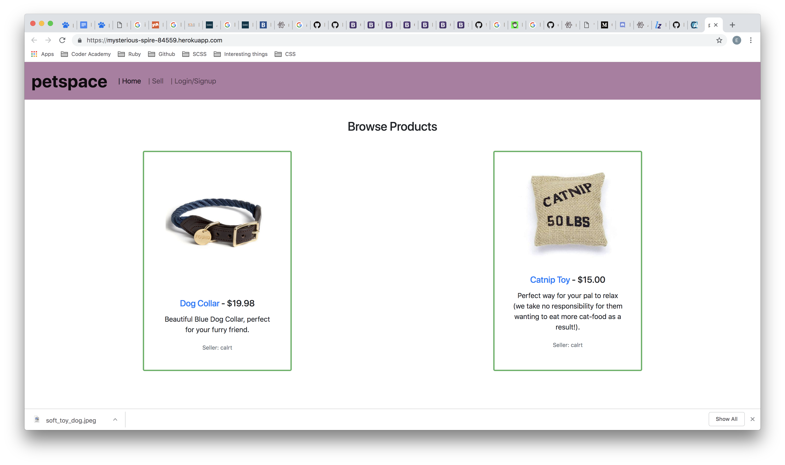

# README

# petspace

Visit our web application [here](https://mysterious-spire-84559.herokuapp.com/).

Visit our Github repository [here](https://github.com/calrt/pets).

### 'petspace' brought to you by:
- Callum Thompson (scrum master)
- Kimberley Tse
- Emily Watson


# Purpose of the project
## The problem we addressed:

Petspace intends to be a service that aims to reduce the impact we have on the environment as pet owners, while also improving the variety and accessibility of pet products on the market.

We aim to do this by making it easier for designers to sell high-quality, hand-made pet products to pet-owners. This will be achieved in the form of a two-way market place for designers and pet owners with an integrated payment system.


## Features

The website allows people to register as users, and subsequently purchase and/or offer products for sale.

Website map:

- Home page: with a view of all available products
- Sign in/ Sign up page: where a user can create an account or sign in
- View page: for each product where a registered and signed in user can view the product in more detail, and purchase the product, so long as it is not a product they are selling
- Sell page: where a user can enter details (i.e. description, price, shipping price), including uploading an image, of their product
- Edit page: where the user who owns the product can edit details or delete the product

The website is easy to navigate, with well named buttons, a nav-bar and products presented in cards.

Examples of these pages are below:

### Home page:



### Product page:


### Sell/Purchase page:


### Create a product page:


## Instructions for use:

Follow the link to the website: [petspace](https://mysterious-spire-84559.herokuapp.com/)

Navigate to the top of the page 'login/signup', or select a product to create an account. Once you have created an account, you can select a product, click on 'buy' and follow the prompts to make your purchase.

If you would like to sell a product, after logging in or creating an account, navigate to 'sell' on the navigation bar, then enter your product details. Make sure you include a photo! Click 'create product', and you are ready to go! You can edit or delete your product at anytime, just select the product, then go to edit.

When you have finished, select 'logout' from the navigation bar at the top of the page.

# Petspace Mechanism
## Network infrastructure

We used a combination of a Heroku Puma server for our production environment and deployment, AWS S3 for active file storage of images, and GitHub for codebase storage and work-flow management.

## Software used
We have used a number of different tools in order to create Petspace. These include:
* Heroku
* AWS S3
* VS Code
* Google Docs
* Figma

We have also used technologies from across the tech-stack including Ruby, Rails, Javascript, HTML & CSS.


## Database
For our project we have utilised a PostgreSQL database. The reason for this is because this is the database we have the most experience with as a team and because of the amount of features and compatibility with rails relative to other free alternatives.

We also appreciate the fact that PostgreSQL is open-source and is therefore supported by a wide community of developers like us.

### Database setup
Our Database contains three tables:
* Orders
* Users
* Products

## Architecture
The app is based on RESTful principles and has been implemented in a way so that it allows for full CRUD capability (Create, Read, Update, and Destroy).

This means we have
* Forms to sell products
* The ability browse a product directory and at the individual level in more depth.
* The ability to delete products
* An ordering system that saves orders to a table so that it can be cross-referenced with Stripe payments

## Third party services
Our App makes use of:
* Heroku (cloud platform for deployment)
* AWS S3 (image storage)
* Stripe (credit card transactions)

## Inspiration
We want to build an e-commerce website focused on handmade pet accessories, as well as unique factory-manufactured items, which is similar to the idea of Etsy, e.g.:


## Database Schema


## Database relations
The app is built on a robust database for storing user, product and transaction records.

There are three models in the database:

User table: This table stores information about individual users.
- Primary Key: email, password & username


Product table: These tables store product information. Products are never deleted in the database.
- Primary Key: name, description, price, shipping price & stock
- Foreign Key: User id

Order table: These tables store information about order information.
- Primary Key: quantity, product title, product price, shipping price, first name, last name, street, suburb, postcode, state, country
- Foreign Key: user id, product id

## Active Record Associations
In Rails, an association is a connection between two Active Record models.

``` ruby
class Order < ApplicationRecord
  belongs_to :user
  belongs_to :product
end

class Product < ApplicationRecord
  belongs_to :user
  has_many :orders
  has_one_attached :image
end

class User < ApplicationRecord
  has_many :products
end
```

# Petspace Methodology
## User Stories
### Buyer
- As a user I want to be able to pay online so that I can gain more credit card points and can make a payment anytime
- As a user I want to have my item delivered so that I do not have to drive somewhere to get it
- As a user I want to purchase unique product for my pets
- As a user I want to have items delivered for a low cost so that I can save money
- As a user I want to be able to view the item before i purchase it
- As a user I prefer to shop online for convenience

### Seller
- As a seller I am looking for a platform that is easy to use
- As a seller I would like to post my product image on the website
- As a seller I would like to set up an online payment system for my user
- As a seller I am looking to increase my sales and product awareness by having an internet presence, without having to maintain a website myself

### Workflow Diagram of User Journey/s


# Planning Process

## Wireframes

### Initial design:


### Design evolution:


### Pinterest mood-board


## Project Plan and Timeline:

## Trello

We have equally distributed the work and followed our code of conduct. Visit our [trello-board](https://trello.com/b/yvCD3Gal/rails-project), or see screen shots below:


## Communication

In person and on slack. An example of the daily conversations on slack are below:


## Agile Methodology

Our group was able to successfully work together to produce a working web application, in the allotted time, through the implementation of agile methodology. Callum was allocated as scrum-master, but for the most part the team worked as equals. A typical working day for our team looked like this:

10:00 am - stand up

  Reflection of current progress, discussion of any challenges and/or concerns, followed by outlining what we would like to achieve for the day. We would then either divide the work, or elect an element to work on all-together.

10.15 - 4.30 - project work time, inclusive of regular breaks.

  We worked in person, and would frequently check in with each other, often swapping from working on individual branches to pair programming as deemed necessary.

4.30 - wrapping up work for the day, and end-of-day stand up.

  This time of day we would discuss our progress and amend our trello board to include topics for discussion for the next morning. We also took the time to congratulate each other on our achievements, and to thank each other for the work contributed.

We committed early and often, and the same for deployment to Heroku. Given the time constraints, emphasis was made on usability and simplicity over complexity and aesthetic features.

Communication was key, and early on we agreed on working hours, essential product features, method of version control, and group and individual expectations. The scrum-master held the repository with the master code as the source of truth, and would check over all pull requests before completing a branch merge.

The team was flexible at all times, whether it be a need to change the work start time, or a tactical decision on deploying a particular feature. All team members were valued, heard and respected. As a result, the work environment was safe, trusting, fun, and highly productive. Each team member learnt from the other members, and contributed knowledge in turn.


## Source Control Process Git

### 1. GitHub Repository
* Source of truth for the code
* Held on the srum master’s repository
* Other team-members as collaborators on the repository

### 2. Team members
* Git pull source code
* Git branch for editing
* Git push origin branch
* Pull request

### 3. GitHub
* Code/changes reviewed by scrum-master or other team member
* Once approved and conflicts (if any) resolved, branch is merged

The cycle begins again.


From the beginning, our team agreed that we wanted our source control to be both convenient and reliable. For this reason, we chose the scrum-master’s GitHub account to house the master code as a source of truth, with the other two members of the group added as collaborators.

Once the initial rails project had been started, the very first commit and push of the origin master went straight to the repository. After this, each member of the team would git pull a copy of the master code to their machine, rather than needing to re-clone the repository every time a change was merged with the master. Changes were made using branches only, and never merged directly to the master, thus protecting the master code and allowing easy resolution of any conflicts.

Branches were merged via pull requests, where either the scrum-master or another team member would review the code and help resolve any conflicts before merging the branch.

## Testing process

After every change, we would check to see if the change had worked by accessing the application on our local host. We would also check on the Heroku deployment to make sure everything was running correctly.

Error and deployment logs were checked regularly. We also had frequent checks from teachers throughout the building time.

We also found testing on each person's local host immediately after a brach merge a useful way to discover (and subsequently resolve) any bugs not discovered by the team member who was working on that branch.  

## Information System Security

Throughout the development process, the team was mindful of the ethics behind handling user data. This is one of the reasons we chose to use stripe for processing credit card payments; stripe handles the sensitive data, such as credit card numbers, eliminating the need to keep these in our own database.

We do, however, have the address and name of the buyer in the database when a sale is made. The data is kept in order to allow us to track sales, including where the product was shipped to. It is necessary to keep this data in the database, but it is also necessary to protect the data. For this reason, the recipient address is not published on the website, nor is it traceable in the url path once the user has navigated away from the page.

The other consideration is the integrity of the data in the database. When a user inputs their address during a purchase, that data is used to post the item to them. The address data is then kept in the database as it is associated with that particular order at that particular time. The address could not be used to track the particular user, as addresses are changeable, it is merely there to provide information on orders.

Personal information such as passwords (which are encrypted and hashed automatically), email addresses and postal address are not published on the website for public viewing, nor given out to other users or third-party companies. The data is used only for research and history in relation to the website i.e. order tracking.

## Information & Data Protection

The primary information and data protection concerns on our application were the permissions users had for buying, selling and deleting products. These were addressed by using the gem ‘devise’ to specify who had access where and to what, without compromising the integrity of the database.

Anyone can visit petspace and view the products there, however, to purchase a product or to sell a product, you must create an account.

As a buyer, when you sign in you can access the ‘buy’ button on the product of your choice, and from there follow the prompts to make your purchase. You cannot edit or delete the product.

As a seller, when signed in you can view, edit and delete only products that you created. You cannot buy your own products, nor can you edit or delete products created by another user. You can view and purchase products created by another user.

Once a product is deleted, or has run out of stock, users are no longer able to view the product. Products cannot be completely deleted from our database, as we still need to be able to view them when viewing order records in rails console.

To counteract users who are savvy enough to know what to put in the url path to try to view, buy, edit or delete a product when they do not have position, the show page will give them an error message, and a link to redirect them back to the home page.

In future development, where features such as use dashboards are implemented, we would likely switch to using pundit to further tighten security.

We also used the gem ‘stripe’ for purchase transactions, as stripe securely handles credit card details.

Passwords are encrypted and hashed automatically through devise.


## Legal Obligation

According to the Australian Government Privacy Act (1988), and the Australian Privacy Principles (APP) at the Australian [OAIC](https://www.oaic.gov.au/privacy-law/privacy-act/australian-privacy-principles) website, our obligations include:

* Having a privacy policy about the management of personal information
* Giving the option for anonymity or use of pseudonyms
* Giving notice about collection of solicited  and unsolicited personal information
* How personal information is used and disclosed
* Maintaining the quality of the information
* Keeping the information secure
* The right of individuals to access and correct personal information


We also have a responsibility to keep the data safe from theft, misuse, interference, loss, unauthorised access, modification and disclosure. Collection of personal information is only when essential for the function or activity of the business. Unsolicited personal information is de-identified or deleted.

A clear and up to date privacy policy needs to outline what information is collected, what it is used for, and how it is protected.

Currently, there is no privacy policy on our website, as we believe the best method for this would be in consultation with a legal expert.


© petspace 2018, C. Thompson, K. Tse and E. Watson
